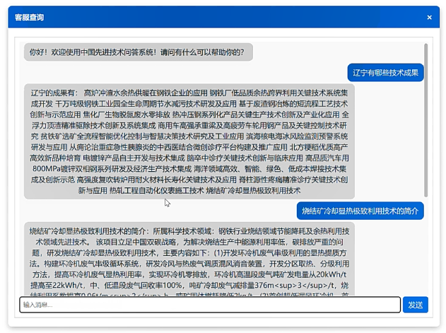

# 基于Neo4j的中国先进技术问答系统

该项目是一个基于模板匹配的问答系统，通过预先定义的模板来匹配用户问题，并返回相应答案，我们一共设计了20类问题，基本涵盖了基于本数据库的所有内容。

## 如何使用

在命令行输入以下代码部署项目
```
# 项目部署
git clone https://gitee.com/xuefeiyuy/langgraph_my.git
# 创建虚拟环境
conda create -n 环境名字 python=版本
conda activate 环境名字
# 下载依赖
pip install -r requirements.txt
```
在运行代码之前，你需要先下载Neo4j，并上传数据，即updated_data.xlsx

你可以通过以下语句来上传：

```
// 创建索引（确保字段名与CSV列一致）
CREATE INDEX FOR (p:省市) ON (p.省市名称);
CREATE INDEX FOR (u:完成单位) ON (u.单位名称);
CREATE INDEX FOR (c:联系单位) ON (c.单位名称);
CREATE INDEX FOR (i:应用行业) ON (i.行业名称);
CREATE INDEX FOR (k:关键词) ON (k.关键词文本);
CREATE INDEX FOR (a:领域分类) ON (a.分类名称);
CREATE INDEX FOR (r:成果) ON (r.标题);

// 导入数据并创建节点
LOAD CSV WITH HEADERS FROM "file:///research_data.csv" AS row
MERGE (p:省市 {省市名称: row.省市})
MERGE (u:完成单位 {单位名称: row.完成单位})
MERGE (c:联系单位 {
  单位名称: row.联系单位名称,
  联系地址: row.联系单位地址,
  邮政编码: row.邮政编码
})
MERGE (i:应用行业 {
  行业名称: row.应用行业名称,
  行业码: row.应用行业码
})
MERGE (a:领域分类 {分类名称: row.领域类别})
MERGE (r:成果 {
  标题: row.标题,
  项目年度编号: row.项目年度编号,
  成果类别: row.成果类别,
  成果公布年份: TOINTEGER(row.成果公布年份),
  成果简介: row.成果简介,
  限制使用: row.限制使用
})
WITH row
WHERE row.关键词1 <> '' OR row.关键词2 <> '' OR row.关键词3 <> ''
MERGE (k1:关键词 {关键词文本: row.关键词1})
MERGE (k2:关键词 {关键词文本: row.关键词2})
MERGE (k3:关键词 {关键词文本: row.关键词3});

// 创建关系
LOAD CSV WITH HEADERS FROM "file:///research_data.csv" AS row
MATCH (r:成果 {标题: row.标题})
MATCH (p:省市 {省市名称: row.省市})
MERGE (r)-[:位于]->(p);

LOAD CSV WITH HEADERS FROM "file:///research_data.csv" AS row
MATCH (u:完成单位 {单位名称: row.完成单位})
MATCH (p:省市 {省市名称: row.省市})
MERGE (u)-[:位于]->(p);

LOAD CSV WITH HEADERS FROM "file:///research_data.csv" AS row
MATCH (c:联系单位 {单位名称: row.联系单位名称})
MATCH (p:省市 {省市名称: row.省市})
MERGE (c)-[:位于]->(p);

LOAD CSV WITH HEADERS FROM "file:///research_data.csv" AS row
MATCH (r:成果 {标题: row.标题})
MATCH (u:完成单位 {单位名称: row.完成单位})
MERGE (r)-[:由完成]->(u);

LOAD CSV WITH HEADERS FROM "file:///research_data.csv" AS row
MATCH (r:成果 {标题: row.标题})
MATCH (c:联系单位 {单位名称: row.联系单位名称})
MERGE (r)-[:由联系]->(c);

LOAD CSV WITH HEADERS FROM "file:///research_data.csv" AS row
MATCH (r:成果 {标题: row.标题})
MATCH (i:应用行业 {行业名称: row.应用行业名称})
MERGE (r)-[:应用于]->(i);

LOAD CSV WITH HEADERS FROM "file:///research_data.csv" AS row
MATCH (r:成果 {标题: row.标题})
MATCH (a:领域分类 {分类名称: row.领域类别})
MERGE (r)-[:属于]->(a);

LOAD CSV WITH HEADERS FROM "file:///research_data.csv" AS row
WITH row WHERE row.关键词1 <> ''
MATCH (r:成果 {标题: row.标题})
MATCH (k:关键词 {关键词文本: row.关键词1})
MERGE (r)-[:包含关键词]->(k);

LOAD CSV WITH HEADERS FROM "file:///research_data.csv" AS row
WITH row WHERE row.关键词2 <> ''
MATCH (r:成果 {标题: row.标题})
MATCH (k:关键词 {关键词文本: row.关键词2})
MERGE (r)-[:包含关键词]->(k);

LOAD CSV WITH HEADERS FROM "file:///research_data.csv" AS row
WITH row WHERE row.关键词3 <> ''
MATCH (r:成果 {标题: row.标题})
MATCH (k:关键词 {关键词文本: row.关键词3})
MERGE (r)-[:包含关键词]->(k);
```

你需要先修改backend中的config.py文件替换你的Neo4j账户与密码，再运行backend中的app.py，然后在终端处进入frontend目录，运行npm run dev，此时会弹出一个网址，进入网址你就能见到问答系统了。

效果如下



---

## 20类问题

1. **简介类问题**

疑问词：['简介', '信息', '资料', '介绍', '表现']

示例问题：

“人工智能的简介是什么？”

“请介绍深度学习的主要信息。”

2. **时间类问题**

疑问词：['什么时候', '时间', '年份', '何时']

示例问题：“人工智能是什么时候出现的？”

3. **分类类问题**

疑问词：['属于什么领域', '领域', '分类', '类别']

示例问题：“人工智能属于什么领域？”

4. **地点类问题**

疑问词：['位于哪里', '位置', '所在地', '分布']

示例问题：“人工智能的主要研究机构位于哪里？”

5. **关键词类问题**

疑问词：['关键词', '关键点', '主要词', '核心技术']

示例问题：“人工智能的关键词是什么？”

6. **应用类问题**

疑问词：['应用于', '应用在', '使用于', '应用于哪些']

示例问题：“人工智能应用于哪些领域？”

7. **单位类问题**

疑问词：['由谁完成', '完成单位', '完成方', '开发单位']

示例问题：“深度学习的主要开发单位有哪些？”

8. **相关类问题**

疑问词：['相关成果', '类似成果', '相关技术', '关联成果']

示例问题：“人工智能的相关成果有哪些？”

9. **单位成果类问题**

疑问词：['成果', '主要成就', '代表成果', '技术成果']

示例问题：“清华大学在人工智能领域的主要成果有哪些？”

10. **省市成果类问题**

疑问词：['成果', '技术成果', '先进技术', '有哪些技术成果', '有哪些成果', '有什么技术成果']

示例问题：“北京在人工智能领域有哪些成果？”

11. **行业成果类问题**

疑问词：['使用的技术', '应用的技术', '采用的技术']

示例问题：“医疗行业使用的人工智能技术有哪些？”

12. **关键词成果类问题**

疑问词：['相关成果', '涉及的技术', '相关成果']

示例问题：“关键词‘深度学习’的相关成果有哪些？”

13. **分类成果类问题**

疑问词：['包含哪些成果', '主要成果', '代表性成果']

示例问题：“人工智能领域包含哪些主要成果？”

14. **详细信息类问题**

疑问词：['详情', '详细介绍', '详细信息']

示例问题：“请提供人工智能技术的详细介绍。”

15. **判断类问题**

疑问词：['是', '属于', '正确', '对', '正确吗']

示例问题：“人工智能是属于计算机科学领域吗？”

16. **单位地址类问题**

疑问词：['地址', '位置', '在哪里', '在哪', '坐标的']

示例问题：“清华大学的地址是什么？”

17. **邮政编码类问题**

疑问词：['邮政编码', '邮编', '编码']

示例问题：“清华大学的邮政编码是什么？”

18. **关键词搜索类问题**

疑问词：['关键词', '关键字', '包含', '含有']

示例问题：“包含关键词‘深度学习’的成果有哪些？”

19. **统计类问题**

疑问词：['多少', '数量', '统计', '共有', '总数']

示例问题：“人工智能领域有多少成果？”

20. **否定类问题**

疑问词：['不是', '不属于', '错误', '错', '错误吗']

示例问题：“人工智能不属于计算机科学领域吗？”

---

## 感谢三位室友的工作！！！

